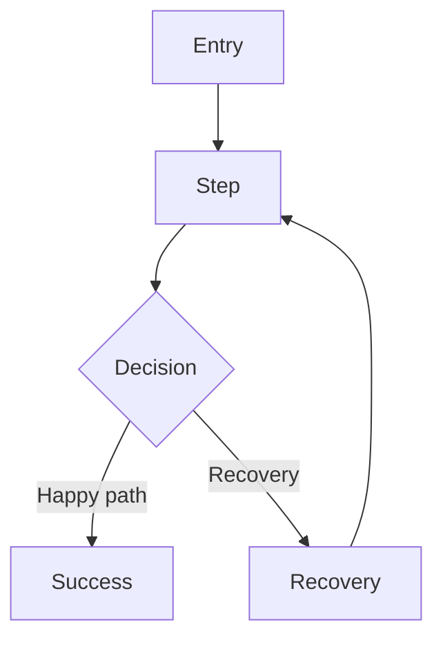

# Journey Flow

| Field         | Value                                   |
| ------------- | --------------------------------------- |
| Journey       | JRN.<domain>.<goal>.<channel>.<variant> |
| Platform      | TBD(owner)                              |
| Auth state    | TBD(owner)                              |
| Locale/device | TBD(owner)                              |

## Flow

## Nodes

| Node | Screen/touchpoint | User action | System response | State/data |
| ---- | ----------------- | ----------- | --------------- | ---------- |
| A    | TBD(owner)        | TBD(owner)  | TBD(owner)      | TBD(owner) |

## Decisions

| Decision   | Branches   | Rule       | Recovery   |
| ---------- | ---------- | ---------- | ---------- |
| TBD(owner) | TBD(owner) | TBD(owner) | TBD(owner) |

## Accessibility

| Area          | Requirement | Check      |
| ------------- | ----------- | ---------- |
| Keyboard      | TBD(owner)  | TBD(owner) |
| Screen reader | TBD(owner)  | TBD(owner) |
| Error state   | TBD(owner)  | TBD(owner) |
